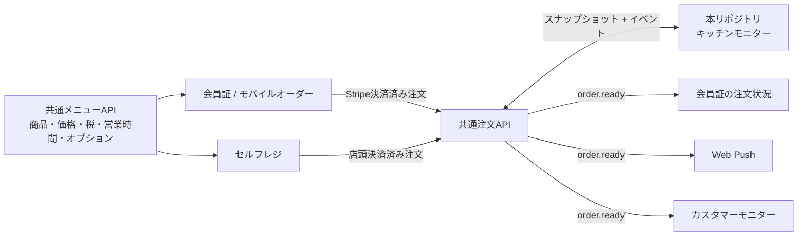

# COMPASSION WORLD Kitchen

COMPASSION WORLDのキッチン業務に特化した、タブレット向け注文モニターです。会員証・モバイルオーダーとは画面とリポジトリを分離し、共通APIを通じて注文を受け取ります。

## このリポジトリの責任範囲

- 確定済み注文の表示と優先順位付け
- `ACCEPTED → COOKING → READY → PICKED_UP` のキッチン状態遷移
- 注文番号、受取希望時刻、提供予定時刻、商品、数量、オプション、調理指示の表示
- 操作の二重送信防止、競合の検知、状態履歴の参照
- 端末再接続時のスナップショット再取得とイベント差分同期
- `READY` イベントの発行（通知先への直接送信は共通注文基盤の責任）

このリポジトリは商品・価格・税・表示順・営業時間・時間帯制限・オプションの正本を持ちません。また、決済確定、会員認証、Web Push配信、会員証画面、カスタマーモニターも担当しません。

## システム構成



詳細な状態機械とAPIペイロードは [docs/order-api-v1.md](docs/order-api-v1.md) を参照してください。既存会員証実装との確認結果は [docs/members-compatibility.md](docs/members-compatibility.md) に記録しています。

## 開発

Node.js 22.13以上が必要です。

```bash
npm install
npm run dev
```

品質確認:

```bash
npm run build
npm run lint
```

現時点の画面は、API接続前に業務フローを確認できる操作可能なプロトタイプです。「調理を開始」「提供可能にする」「受け渡し完了」でカードが次の状態へ移動します。

## 実装原則

- 金額は整数の円で扱い、表示時点の名称・価格・税・オプションを注文にスナップショット保存する
- 書き込みには `Idempotency-Key`、状態更新には `expectedVersion` を必須とする
- 状態履歴は追記のみとし、注文の現在状態とは別に保持する
- クライアントはイベントだけを正本とせず、起動時・再接続時に必ず注文一覧を再取得する
- `READY` の副作用は Transactional Outbox で確実にイベント化する
